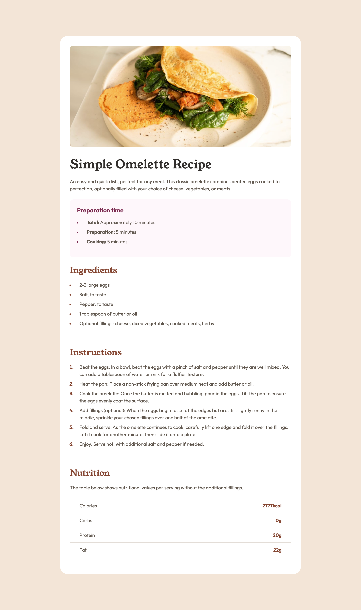
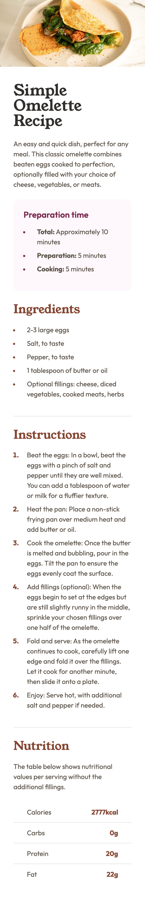

# Frontend Mentor - Recipe page solution

This is a solution to the [Recipe page challenge on Frontend Mentor](https://www.frontendmentor.io/challenges/recipe-page-KiTsR8QQKm). Frontend Mentor challenges help you improve your coding skills by building realistic projects. 

## Table of contents

- [Overview](#overview)
  - [The challenge](#the-challenge)
  - [Screenshot](#screenshot)
  - [Links](#links)
- [My process](#my-process)
  - [Built with](#built-with)
  - [What I learned](#what-i-learned)
  - [Continued development](#continued-development)
- [Author](#author)

## Overview

### Screenshot

#### Desktop


#### Mobile



### Links

- [Solution URL:](https://github.com/fvdumah/Recipe-Page) 
- [Live Site URL:](https://fvdumah.github.io/Recipe-Page/)

## My process

### Built with

- Semantic HTML5 markup
- CSS custom properties
- Flexbox
- Mobile-first workflow


### What I learned

I learnt how to style li elements.
 - increase padding/margin 
 - change colour of markers
 - change font-weight of markers

```css
li::marker {
  color: #854632;
  font-weight: bold;
}

li {
  padding-left: 1rem;
}
```

### Continued development

There's a lot of things I would like to do differently.
Motto that got me through to solution is bad code is good code :D
Next challenge there a few things I would try differently 
- Display Image based on viewport (this challenge I struggled and just added the image )
- Style items in root first e.g font size, font-weight, colours.


## Author

- Website - [fvdumah](https://github.com/fvdumah)
- Frontend Mentor - [@fvdumah](https://www.frontendmentor.io/profile/fvdumah)
